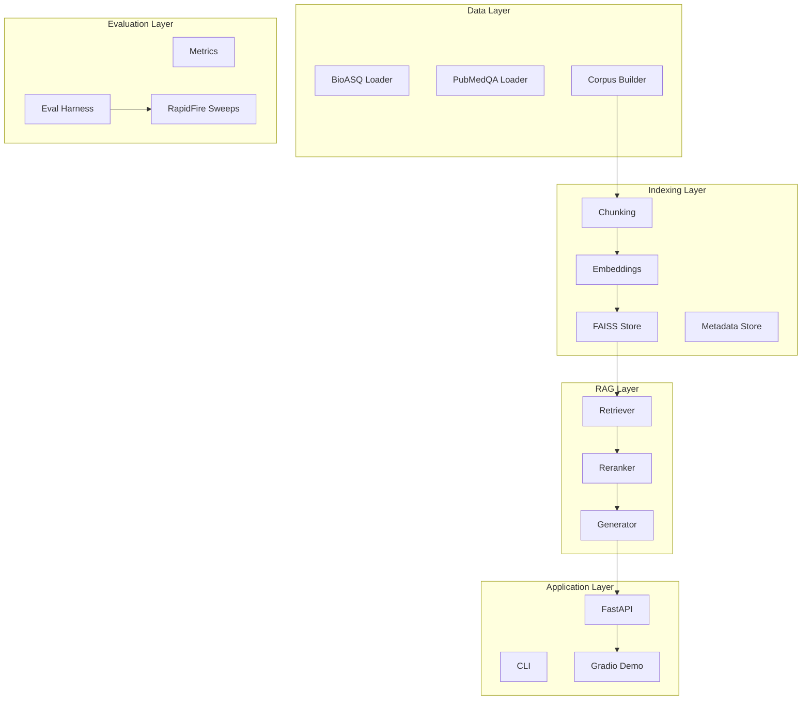

# BioRAG Bench Implementation Plan

This plan builds the biomedical RAG pipeline in 8 phases, prioritizing a working demo first (as requested), then adding evaluation and optimization capabilities. Each phase includes testable deliverables.

---

## Architecture Overview

---

## Phase 0: Project Foundation (Day 1-2)

**Goal:** Establish project structure, dependencies, and testing infrastructure.

### Tasks

1. **Create project structure** following the repo layout in SPEC Section 5.3
2. **Set up `pyproject.toml`** with dependencies:

   - Core: `langchain`, `langchain-community`, `langchain-openai`, `faiss-cpu`, `torch`
   - API: `fastapi`, `uvicorn`
   - Demo: `gradio`
   - Testing: `pytest`, `pytest-cov`, `pytest-asyncio`
   - Utils: `pydantic>=2.0`, `pyyaml`, `python-dotenv`, `typer`, `rich`

3. **Configure pytest** with coverage reporting in `pyproject.toml`
4. **Create `.env.example`** documenting `OPENAI_API_KEY`
5. **Create `Makefile`** with common commands: `install`, `test`, `lint`, `serve`
6. **Implement basic config loader** (`src/biorag/schemas/config.py`)

### Testing

- Unit test: Config schema validation
- Smoke test: pytest runs successfully with empty test file

### Key Files

- `pyproject.toml`, `Makefile`, `.env.example`, `.gitignore`
- `src/biorag/__init__.py`, `src/biorag/schemas/config.py`
- `tests/conftest.py`, `tests/unit/test_config.py`

---

## Phase 1: Data Foundation (Day 2-4)

**Goal:** Implement data loaders and corpus builder with reproducible provenance.

### Tasks

1. **Define Pydantic schemas** (`src/biorag/schemas/`):

   - `corpus.py`: `CorpusDocument`, `Chunk`
   - `evaluation.py`: `BioASQQuestion`, `PubMedQAQuestion`, `EvalResult`
   - `generation.py`: `AnswerOutput`, `Citation`

2. **Implement BioASQ loader** (`src/biorag/data/bioasq_loader.py`):

   - Parse official JSON format
   - Extract: `question_id`, question text, type, gold docs/snippets, exact/ideal answers
   - Use HuggingFace `bigbio/bioasq_task_b` as convenience source

3. **Implement PubMedQA loader** (`src/biorag/data/pubmedqa_loader.py`):

   - Parse train/val/test splits
   - Extract: `question_id`, question, label (yes/no/maybe), context

4. **Implement Corpus Builder** (`src/biorag/data/corpus_builder.py`):

   - Download PubMed abstracts from HuggingFace dataset
   - Include gold PMIDs from BioASQ + PubMedQA
   - Sample distractor set with fixed seed (default: 10k)
   - Generate `data/raw/manifest.json` with provenance
   - Output: `data/processed/corpus/corpus.jsonl`

5. **Create golden suite** sampling script (`scripts/create_golden_suite.py`):

   - Sample 200 BioASQ questions deterministically
   - Sample 500 PubMedQA questions deterministically
   - Output to `data/golden/`

### Testing

- Unit tests: Schema validation, loader parsing with mock data
- Integration test: Load small subset from HuggingFace, verify structure

### Key Files

- `src/biorag/schemas/corpus.py`, `evaluation.py`, `generation.py`
- `src/biorag/data/bioasq_loader.py`, `pubmedqa_loader.py`, `corpus_builder.py`
- `tests/unit/test_schemas.py`, `test_loaders.py`

---

## Phase 2: Indexing Pipeline (Day 4-6)

**Goal:** Implement chunking, embedding, and FAISS indexing.

### Tasks

1. **Implement chunking module** (`src/biorag/chunking/`):

   - `base.py`: Abstract `Chunker` interface
   - `recursive.py`: Sentence-aware `RecursiveChunker` using LangChain's `RecursiveCharacterTextSplitter`
   - `token.py`: Token-based `TokenChunker` (baseline)
   - Store metadata: `pmid`, `chunk_id`, offsets

2. **Implement embeddings module** (`src/biorag/embeddings/`):

   - `base.py`: Abstract `Embedder` interface with `embed_documents()` and `embed_query()`
   - `openai.py`: OpenAI embeddings wrapper (text-embedding-3-large)
   - `cache.py`: Disk-based embedding cache keyed by `(model, chunk_hash)`

3. **Implement FAISS indexing** (`src/biorag/indexing/`):

   - `faiss_store.py`: FAISS index wrapper with save/load
   - `metadata_store.py`: SQLite-based chunk metadata store
   - Support deterministic rebuild from corpus + config

4. **Add CLI commands** (`src/biorag/cli/main.py`):

   - `build_corpus`: Build corpus from HuggingFace
   - `index_faiss`: Build FAISS index from corpus

### Testing

- Unit tests: Chunking produces expected chunks with metadata
- Unit tests: Embedding cache hit/miss behavior
- Integration test: Index 100 documents, verify retrieval returns results

### Key Files

- `src/biorag/chunking/base.py`, `recursive.py`, `token.py`
- `src/biorag/embeddings/base.py`, `openai.py`, `cache.py`
- `src/biorag/indexing/faiss_store.py`, `metadata_store.py`
- `tests/unit/test_chunking.py`, `test_embeddings.py`

---

## Phase 3: Retrieval and Reranking (Day 6-8)

**Goal:** Implement configurable retrieval and GPU-accelerated reranking.

### Tasks

1. **Implement retriever** (`src/biorag/retrieve/retriever.py`):

   - Modes: `similarity` (top-k), `mmr`, `similarity_score_threshold`
   - Sweepable params: `k`, `fetch_k`, `lambda_mult`, `score_threshold`
   - Return ranked `Document` objects with scores and metadata

2. **Implement reranking module** (`src/biorag/rerank/`):

   - `base.py`: Abstract `Reranker` interface
   - `cross_encoder.py`: HuggingFace cross-encoder (GPU-accelerated)
     - Default model: `cross-encoder/ms-marco-MiniLM-L-6-v2` (fast) or `cross-encoder/ms-marco-TinyBERT-L-2-v2`
   - `llm_reranker.py`: Optional OpenAI-based reranker (for comparison)
   - Sweepable params: `model`, `top_n`, `final_k`

3. **Add CLI command**:

   - `retrieve`: Retrieve chunks for a query (for debugging)

### Testing

- Unit tests: Retriever modes return correct number of results
- Unit tests: Reranker reorders results based on scores
- Integration test: End-to-end retrieve + rerank on indexed corpus

### Key Files

- `src/biorag/retrieve/retriever.py`
- `src/biorag/rerank/base.py`, `cross_encoder.py`, `llm_reranker.py`
- `tests/unit/test_retrieval.py`, `test_rerank.py`

---

## Phase 4: Generation (Day 8-10)

**Goal:** Implement prompt management, structured LLM output, and abstention logic.

### Tasks

1. **Implement prompt management** (`src/biorag/generate/prompts.py`):

   - Load templates from `configs/prompts/`
   - Template variables: evidence chunks, question, citation format
   - Create initial templates: `cite_and_abstain_v1.txt`, `cite_and_abstain_v2.txt`

2. **Implement generator** (`src/biorag/generate/generator.py`):

   - Use OpenAI structured outputs / JSON mode
   - Enforce `AnswerOutput` schema via Pydantic
   - Retry logic on validation failure (up to N retries)
   - Cache LLM outputs by prompt hash (NFR-3)

3. **Implement abstention logic** (`src/biorag/generate/abstention.py`):

   - Evidence thresholding: `min_evidence_score`, `min_evidence_chunks`
   - Model self-check: `supported=true|false` flag
   - Log abstention reasons

4. **Implement citation enforcement**:

   - Validate citations reference actual `pmid` + `chunk_id` from evidence
   - Policy toggle: strict vs claim-level

5. **Implement cost control utilities** (`src/biorag/utils/cost.py`):

   - Token counting
   - Budget guardrails: `max_questions`, `max_total_tokens`, `max_usd`
   - Per-run cost reporting

### Testing

- Unit tests: Prompt template rendering
- Unit tests: Output schema validation and retry logic
- Unit tests: Abstention triggers correctly
- Unit tests: Cost tracking accumulates correctly

### Key Files

- `src/biorag/generate/prompts.py`, `generator.py`, `abstention.py`
- `src/biorag/utils/cost.py`, `caching.py`
- `configs/prompts/cite_and_abstain_v1.txt`
- `tests/unit/test_generation.py`, `test_cost.py`

---

## Phase 5: RAG Pipeline + Demo (Day 10-14)

**Goal:** Integrate components into end-to-end pipeline, build API and Gradio demo.

### Tasks

1. **Implement RAGPipeline** (`src/biorag/pipeline/rag.py`):

   - Orchestrate: retrieve -> rerank -> generate
   - Accept config, return `AnswerOutput`
   - Include latency tracking per stage

2. **Implement FastAPI backend** (`src/biorag/api/`):

   - `app.py`: FastAPI app factory
   - `routes.py`: Endpoints:
     - `POST /answer`: Full RAG answer with citations
     - `POST /retrieve`: Retrieve chunks only
     - `GET /health`: Health check
   - `dependencies.py`: Pipeline injection

3. **Implement CLI commands**:

   - `serve`: Start FastAPI server

4. **Build Gradio demo** (`demo/app.py`):

   - Single-panel interface (side-by-side comes in Phase 8)
   - Input: Question text
   - Output: Answer, citations, retrieved chunks, latency breakdown
   - Medical disclaimer banner

5. **Create base configuration** (`configs/base.yaml`):

   - Default chunking, retrieval, rerank, LLM settings

### Testing

- Integration test: RAGPipeline end-to-end with mock LLM
- Integration test: FastAPI endpoints return valid responses
- Manual test: Gradio demo runs locally, answers questions

### Key Files

- `src/biorag/pipeline/rag.py`
- `src/biorag/api/app.py`, `routes.py`, `dependencies.py`
- `src/biorag/cli/main.py` (add `serve`)
- `demo/app.py`, `demo/requirements.txt`
- `configs/base.yaml`
- `tests/integration/test_pipeline.py`, `test_api.py`

---

## Phase 6: Evaluation Harness (Day 14-18)

**Goal:** Implement metrics and evaluation framework for BioASQ and PubMedQA.

### Tasks

1. **Implement metrics** (`src/biorag/eval/metrics.py`):

   - Retrieval: `Recall@k`, `MRR`, `Precision@k`, `MAP`
   - Answer: `exact_match`, `token_f1`, `set_f1`, `ROUGE-L`

2. **Implement BioASQ evaluator** (`src/biorag/eval/bioasq_eval.py`):

   - Yes/No: accuracy
   - Factoid: EM, token-F1
   - List: set-F1
   - Summary: ROUGE-L

3. **Implement PubMedQA evaluator** (`src/biorag/eval/pubmedqa_eval.py`):

   - Label prediction accuracy
   - Macro-F1

4. **Implement evaluation harness** (`src/biorag/eval/harness.py`):

   - Run pipeline over golden suite
   - Aggregate metrics
   - Generate `run.json` with reproducibility info (git SHA, config, seeds)

5. **Add CLI command**:

   - `eval`: Run evaluation on golden suite

### Testing

- Unit tests: Each metric function with known inputs/outputs
- Unit tests: Score extraction from various answer types
- Integration test: Harness runs on small golden subset

### Key Files

- `src/biorag/eval/metrics.py`, `bioasq_eval.py`, `pubmedqa_eval.py`, `harness.py`
- `src/biorag/cli/main.py` (add `eval`)
- `tests/unit/test_metrics.py`
- `tests/integration/test_eval_harness.py`

---

## Phase 7: Experiment Runner + Sweeps (Day 18-22)

**Goal:** Integrate RapidFire AI for hyperparallelized parameter sweeps.

### Tasks

1. **Implement single run executor** (`src/biorag/experiments/runner.py`):

   - Execute one config against golden suite
   - Save artifacts: config, predictions, metrics

2. **Implement artifact management** (`src/biorag/experiments/artifacts.py`):

   - `run.json` with full reproducibility info
   - Per-question predictions
   - Metrics summary

3. **Implement RapidFire AI sweep** (`src/biorag/experiments/sweep.py`):

   - Parse sweep config YAML
   - Generate grid of configs
   - Execute via RapidFire AI
   - Aggregate results

4. **Create sweep configurations** (`configs/sweeps/`):

   - `chunking_sweep.yaml`: vary `chunk_size`, `chunk_overlap`
   - `retriever_sweep.yaml`: vary `mode`, `k`, `fetch_k`, `lambda_mult`
   - `full_sweep.yaml`: combined sweep

5. **Generate leaderboard** (`runs/leaderboard.csv`):

   - Rank configs by primary metric
   - Include key params and all metrics

6. **Add CLI command**:

   - `sweep`: Run RapidFire AI sweep

### Testing

- Unit tests: Grid generation from sweep config
- Integration test: Run mini-sweep (2-3 configs) on tiny golden subset

### Key Files

- `src/biorag/experiments/runner.py`, `sweep.py`, `artifacts.py`
- `configs/sweeps/chunking_sweep.yaml`, `retriever_sweep.yaml`, `full_sweep.yaml`
- `tests/integration/test_sweep.py`

---

## Phase 8: Demo Enhancement + Deployment (Day 22-26)

**Goal:** Add side-by-side comparison and deploy to HuggingFace Spaces.

### Tasks

1. **Enhance Gradio demo** (`demo/app.py`):

   - Side-by-side comparison: Baseline vs Optimized config
   - Display for each panel:
     - Answer with inline citations
     - Retrieved chunks with scores (before/after rerank)
     - Latency breakdown (retrieve/rerank/generate)
     - Config summary
   - Synced input: same question to both pipelines

2. **Prepare for HuggingFace Spaces**:

   - `demo/requirements.txt`: Minimal dependencies
   - `demo/README.md`: Spaces-specific instructions
   - Pre-build optimized FAISS index for demo

3. **Deploy to HuggingFace Spaces**:

   - Configure Spaces with required secrets
   - Test public access

4. **Add valuable deliverables**:

   - Failure analysis notebook (`notebooks/02_failure_analysis.ipynb`)
   - Cost/latency report in README

### Testing

- Manual test: Side-by-side comparison works locally
- Browser test (via Chrome DevTools MCP): Verify Gradio UI renders correctly
- Smoke test: Deployed Spaces responds to queries

### Key Files

- `demo/app.py` (enhanced)
- `demo/requirements.txt`, `demo/README.md`
- `notebooks/02_failure_analysis.ipynb`

---

## Testing Strategy Summary

| Phase | Unit Tests | Integration Tests |

|-------|-----------|-------------------|

| 0 | Config validation | pytest smoke test |

| 1 | Schema validation, loader parsing | HuggingFace data load |

| 2 | Chunking, embedding cache | Index + retrieve |

| 3 | Retriever modes, reranker | Retrieve + rerank |

| 4 | Prompts, generation, abstention | - |

| 5 | - | Pipeline, API endpoints |

| 6 | Metrics functions | Eval harness |

| 7 | Grid generation | Mini-sweep |

| 8 | - | Browser tests (Gradio UI) |

---

## Timeline Summary

| Phase | Days | Milestone |

|-------|------|-----------|

| 0 | 1-2 | Project structure, tests running |

| 1 | 2-4 | Data loaders working, golden suite created |

| 2 | 4-6 | FAISS index built, retrieval working |

| 3 | 6-8 | Reranking integrated |

| 4 | 8-10 | Generation with structured output |

| 5 | 10-14 | **Demo working locally** |

| 6 | 14-18 | Evaluation harness complete |

| 7 | 18-22 | Sweeps running, leaderboard generated |

| 8 | 22-26 | **Side-by-side demo on HuggingFace Spaces** |

Total: ~26 days (within 4-week target)