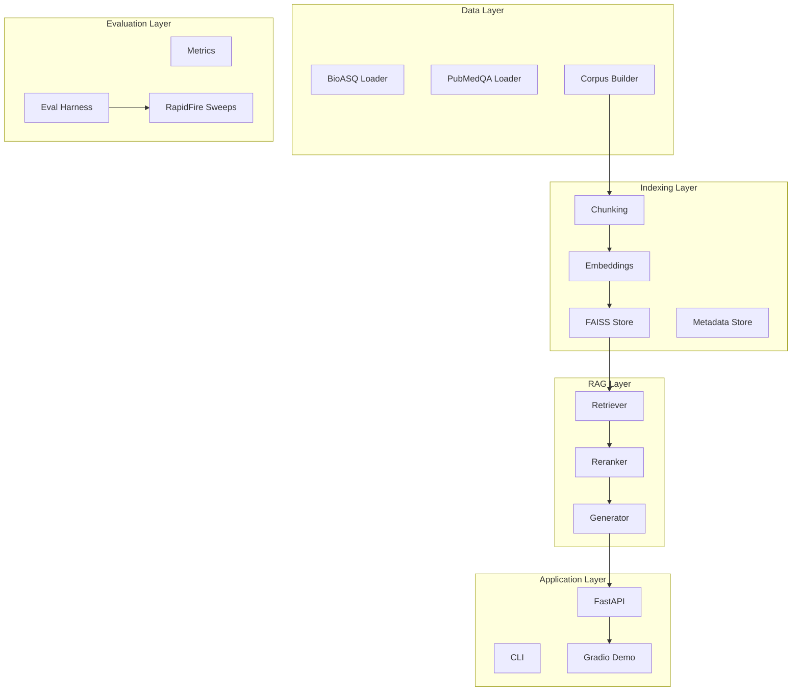

# BioRAG Bench Implementation Plan

This plan builds the biomedical RAG pipeline in 8 phases, prioritizing a working demo first (as requested), then adding evaluation and optimization capabilities. Each phase includes testable deliverables.

---

## Architecture Overview



---

## Phase 0: Project Foundation (Day 1-2)

**Goal:** Establish project structure, dependencies, testing infrastructure, and tooling.

### Tasks

1. **Create project structure** following the repo layout in SPEC Section 5.3:

   - Create all directories: `src/biorag/`, `tests/`, `configs/`, `data/`, `demo/`, `scripts/`, `notebooks/`, `runs/`
   - Create `src/biorag/py.typed` marker file (PEP 561 compliance for mypy)

2. **Set up `pyproject.toml`** with dependencies:

   - Core: `langchain`, `langchain-community`, `langchain-openai`, `faiss-cpu`, `torch`
   - API: `fastapi`, `uvicorn`
   - Demo: `gradio`
   - Testing: `pytest`, `pytest-cov`, `pytest-asyncio`
   - Utils: `pydantic>=2.0`, `pyyaml`, `python-dotenv`, `typer`, `rich`
   - Metrics: `rouge-score`, `bert-score` (optional)

3. **Configure linting and typing tools**:

   - Set up `ruff` configuration in `pyproject.toml` (linting rules, line length, etc.)
   - Set up `mypy` configuration in `pyproject.toml` (strict mode optional)

4. **Configure pytest** with coverage reporting in `pyproject.toml`

5. **Create `.env.example`** documenting `OPENAI_API_KEY`

6. **Create `Makefile`** with common commands:

   - `install`: Install dependencies
   - `test`: Run pytest with coverage
   - `lint`: Run ruff linting
   - `format`: Run ruff formatting
   - `typecheck`: Run mypy (optional)
   - `serve`: Start API server

7. **Implement basic config loader** (`src/biorag/schemas/config.py`)

8. **Implement structured logging utility** (`src/biorag/utils/logging.py`):

   - Structured JSON logging for pipeline stages
   - Configurable log levels
   - Debug output for retrieval/rerank/generate stages

### Testing

- Unit test: Config schema validation
- Smoke test: pytest runs successfully with empty test file
- Lint test: ruff passes on empty project

### Key Files

- `pyproject.toml`, `Makefile`, `.env.example`, `.gitignore`
- `src/biorag/__init__.py`, `src/biorag/py.typed`
- `src/biorag/schemas/config.py`
- `src/biorag/utils/__init__.py`, `src/biorag/utils/logging.py`
- `tests/conftest.py`, `tests/unit/test_config.py`

---

## Phase 1: Data Foundation (Day 2-4)

**Goal:** Implement data loaders and corpus builder with reproducible provenance.

### Tasks

1. **Define Pydantic schemas** (`src/biorag/schemas/`):

   - `corpus.py`: `CorpusDocument`, `Chunk`
   - `evaluation.py`: `BioASQQuestion`, `PubMedQAQuestion`, `EvalResult`, `RunMetrics`
   - `generation.py`: `AnswerOutput`, `Citation`

2. **Implement BioASQ loader** (`src/biorag/data/bioasq_loader.py`):

   - Parse official JSON format
   - Extract: `question_id`, question text, type, gold docs/snippets, exact/ideal answers
   - Use HuggingFace `bigbio/bioasq_task_b` as convenience source

3. **Implement PubMedQA loader** (`src/biorag/data/pubmedqa_loader.py`):

   - Parse train/val/test splits
   - Extract: `question_id`, question, label (yes/no/maybe), context

4. **Implement Corpus Builder** (`src/biorag/data/corpus_builder.py`):

   - Download PubMed abstracts from HuggingFace dataset
   - Pin exact dataset revision (commit hash) for reproducibility
   - Include gold PMIDs from BioASQ + PubMedQA
   - Sample distractor set with fixed seed (default: 10k-20k)
   - Generate `data/raw/manifest.json` with full provenance:
     - Corpus build timestamp
     - Source method: `huggingface`
     - Dataset name, version, revision/commit, splits/shards
     - Sampling & filtering config (`sampling_seed`, gold PMID inclusion rule)
     - Counts (#PMIDs gold, #PMIDs distractors, #records materialized)
     - SHA256 checksums of output files
   - Output: `data/processed/corpus/corpus.jsonl`
   - Output PMID lists: `data/processed/pmids_gold.txt`, `data/processed/pmids_distractors.txt`
   - Support resume/restart with checkpoints
   - Retry transient download/IO failures

5. **Create utility scripts** (`scripts/`):

   - `download_datasets.py`: Fetch BioASQ + PubMedQA from HuggingFace
   - `create_golden_suite.py`: Sample golden suite deterministically
     - 200 BioASQ questions (seeded sampling)
     - 500 PubMedQA questions (seeded sampling)
     - Output to `data/golden/bioasq_golden_200.jsonl` and `pubmedqa_golden_500.jsonl`
   - `validate_golden_suite.py`: Sanity check golden files structure and integrity

6. **Create data exploration notebook** (`notebooks/01_data_exploration.ipynb`):

   - Explore BioASQ question types distribution
   - Explore PubMedQA label distribution
   - Corpus statistics (abstract lengths, year distribution)

7. **Add CLI commands** (`src/biorag/cli/main.py`):

   - `ingest_bioasq`: Load and validate BioASQ dataset
   - `ingest_pubmedqa`: Load and validate PubMedQA dataset

### Testing

- Unit tests: Schema validation, loader parsing with mock data
- Integration test: Load small subset from HuggingFace, verify structure

### Key Files

- `src/biorag/schemas/corpus.py`, `evaluation.py`, `generation.py`
- `src/biorag/data/bioasq_loader.py`, `pubmedqa_loader.py`, `corpus_builder.py`
- `src/biorag/cli/__init__.py`, `src/biorag/cli/main.py`
- `scripts/download_datasets.py`, `create_golden_suite.py`, `validate_golden_suite.py`
- `notebooks/01_data_exploration.ipynb`
- `tests/unit/test_schemas.py`, `test_loaders.py`

---

## Phase 2: Indexing Pipeline (Day 4-6)

**Goal:** Implement chunking, embedding, and FAISS indexing.

### Tasks

1. **Implement chunking module** (`src/biorag/chunking/`):

   - `base.py`: Abstract `Chunker` interface
   - `recursive.py`: Sentence-aware `RecursiveChunker` using LangChain's `RecursiveCharacterTextSplitter`
   - `token.py`: Token-based `TokenChunker` (baseline)
   - Store metadata: `pmid`, `chunk_id`, offsets, section tags if available
   - Output: `data/processed/corpus/chunks.jsonl`

2. **Implement embeddings module** (`src/biorag/embeddings/`):

   - `base.py`: Abstract `Embedder` interface with `embed_documents()` and `embed_query()`
   - `openai.py`: OpenAI embeddings wrapper (text-embedding-3-large)
   - `local.py`: Optional local HuggingFace embeddings (cost reduction for development)
   - `cache.py`: Disk-based embedding cache keyed by `(model, chunk_hash)`
   - Store cached embeddings in `data/processed/embeddings/`

3. **Implement FAISS indexing** (`src/biorag/indexing/`):

   - `faiss_store.py`: FAISS index wrapper with save/load
   - `metadata_store.py`: SQLite-based chunk metadata store (or Parquet/JSONL)
   - Support deterministic rebuild from corpus + config

4. **Add CLI commands** (`src/biorag/cli/main.py`):

   - `build_corpus`: Build corpus from HuggingFace (uses corpus_builder)
   - `index_faiss`: Build FAISS index from corpus

### Testing

- Unit tests: Chunking produces expected chunks with metadata
- Unit tests: Embedding cache hit/miss behavior
- Integration test: Index 100 documents, verify retrieval returns results

### Key Files

- `src/biorag/chunking/base.py`, `recursive.py`, `token.py`
- `src/biorag/embeddings/base.py`, `openai.py`, `local.py`, `cache.py`
- `src/biorag/indexing/faiss_store.py`, `metadata_store.py`
- `tests/unit/test_chunking.py`, `test_embeddings.py`

---

## Phase 3: Retrieval and Reranking (Day 6-8)

**Goal:** Implement configurable retrieval and GPU-accelerated reranking.

### Tasks

1. **Implement retriever** (`src/biorag/retrieve/retriever.py`):

   - Modes: `similarity` (top-k), `mmr`, `similarity_score_threshold`
   - Sweepable params: `k`, `fetch_k`, `lambda_mult`, `score_threshold`
   - Return ranked `Document` objects with scores and metadata
   - Support batch retrieval for evaluation efficiency (NFR-2)

2. **Implement reranking module** (`src/biorag/rerank/`):

   - `base.py`: Abstract `Reranker` interface
   - `cross_encoder.py`: HuggingFace cross-encoder (GPU-accelerated)
     - Default model: `cross-encoder/ms-marco-MiniLM-L-6-v2` (fast) or `cross-encoder/ms-marco-TinyBERT-L-2-v2`
     - Support batched reranking for efficiency (NFR-2)
   - `llm_reranker.py`: Optional OpenAI-based reranker (for comparison)
   - Sweepable params: `model`, `top_n`, `final_k`

3. **Add CLI command** (`src/biorag/cli/main.py`):

   - `retrieve`: Retrieve chunks for a query (for debugging)

### Testing

- Unit tests: Retriever modes return correct number of results
- Unit tests: Reranker reorders results based on scores
- Integration test: End-to-end retrieve + rerank on indexed corpus

### Key Files

- `src/biorag/retrieve/__init__.py`, `retriever.py`
- `src/biorag/rerank/base.py`, `cross_encoder.py`, `llm_reranker.py`
- `tests/unit/test_retrieval.py`, `test_rerank.py`

---

## Phase 4: Generation (Day 8-10)

**Goal:** Implement prompt management, structured LLM output, abstention logic, and cost controls.

### Tasks

1. **Implement prompt management** (`src/biorag/generate/prompts.py`):

   - Load templates from `configs/prompts/`
   - Template variables: evidence chunks, question, citation format
   - Create initial templates: `cite_and_abstain_v1.txt`, `cite_and_abstain_v2.txt`

2. **Implement generator** (`src/biorag/generate/generator.py`):

   - Use OpenAI structured outputs / JSON mode
   - Enforce `AnswerOutput` schema via Pydantic
   - Retry logic on validation failure (up to N retries, configurable)
   - On persistent failure, mark sample as `answer_type="unknown"` and log artifact
   - Cache LLM outputs by prompt hash (NFR-3)

3. **Implement abstention logic** (`src/biorag/generate/abstention.py`):

   - Evidence thresholding: `min_evidence_score`, `min_evidence_chunks`
   - Model self-check: `supported=true|false` flag
   - Log abstention reasons (score-based, self-check, or both)

4. **Implement citation enforcement**:

   - Validate citations reference actual `pmid` + `chunk_id` from evidence
   - Policy toggle: strict (every sentence) vs claim-level (each factual claim group)

5. **Implement cost control utilities** (`src/biorag/utils/cost.py`):

   - Token counting (input + output)
   - Budget guardrails:
     - `max_questions`: Hard limit on examples evaluated
     - `max_total_tokens`: Input + output token limit
     - `max_usd`: Estimated cost limit
   - Budget exceeded behavior (configurable):
     - `fail-fast`: Stop the run and mark it failed
     - `skip`: Skip remaining questions and mark run as partial
   - Per-run cost reporting: total tokens, estimated cost, cache hit rate

6. **Implement timeout handling**:

   - Configurable timeout for OpenAI API calls (default: 30 seconds)
   - Retry up to N times on timeout (configurable)
   - Mark sample as failed after exhausting retries

7. **Implement LLM output caching** (`src/biorag/utils/caching.py`):

   - Cache keyed by stable hash of: model name, prompt template version, full rendered prompt, decoding params
   - Prevent re-paying for identical evaluations during sweeps

### Testing

- Unit tests: Prompt template rendering
- Unit tests: Output schema validation and retry logic
- Unit tests: Abstention triggers correctly
- Unit tests: Cost tracking accumulates correctly
- Unit tests: Timeout handling and retry behavior

### Key Files

- `src/biorag/generate/__init__.py`, `prompts.py`, `generator.py`, `abstention.py`
- `src/biorag/utils/cost.py`, `caching.py`
- `configs/prompts/cite_and_abstain_v1.txt`, `cite_and_abstain_v2.txt`
- `tests/unit/test_generation.py`, `test_cost.py`, `test_caching.py`

---

## Phase 5: RAG Pipeline + Demo (Day 10-14)

**Goal:** Integrate components into end-to-end pipeline, build API and Gradio demo.

### Tasks

1. **Implement RAGPipeline** (`src/biorag/pipeline/rag.py`):

   - Orchestrate: retrieve → rerank → generate
   - Accept config, return `AnswerOutput`
   - Include latency tracking per stage (retrieve, rerank, generate)
   - Include debug info in output (chunking config, retriever config, reranker config)

2. **Implement FastAPI backend** (`src/biorag/api/`):

   - `app.py`: FastAPI app factory
   - `routes.py`: Endpoints:
     - `POST /answer`: Full RAG answer with citations
     - `POST /retrieve`: Retrieve chunks only (without generation)
     - `GET /health`: Health check
   - `dependencies.py`: Pipeline injection

3. **Implement CLI commands** (`src/biorag/cli/main.py`):

   - `serve`: Start FastAPI server

4. **Build Gradio demo** (`demo/app.py`):

   - Single-panel interface (side-by-side comes in Phase 8)
   - Input: Question text
   - Output: Answer, citations, retrieved chunks, latency breakdown
   - Medical disclaimer banner prominently displayed
   - Config summary display

5. **Create base configuration** (`configs/base.yaml`):

   - Default chunking, retrieval, rerank, LLM settings as per SPEC Section 5.4:

   ```yaml
   llm:
     provider: openai
     model: gpt-4o-mini
     temperature: 0.0
     max_tokens: 350

   embeddings:
     provider: openai
     model: text-embedding-3-large

   chunking:
     type: recursive
     chunk_size: 350
     chunk_overlap: 40

   retrieval:
     mode: mmr
     k: 10
     fetch_k: 50
     lambda_mult: 0.5

   rerank:
     enabled: true
     model: cross-encoder/ms-marco-MiniLM-L-6-v2
     top_n: 50
     final_k: 8

   prompt:
     template: prompts/cite_and_abstain_v2.txt
   ```

### Testing

- Integration test: RAGPipeline end-to-end with mock LLM
- Integration test: FastAPI endpoints return valid responses
- Manual test: Gradio demo runs locally, answers questions

### Key Files

- `src/biorag/pipeline/__init__.py`, `rag.py`
- `src/biorag/api/app.py`, `routes.py`, `dependencies.py`
- `src/biorag/cli/main.py` (add `serve`)
- `demo/app.py`, `demo/requirements.txt`
- `configs/base.yaml`
- `tests/integration/test_pipeline.py`, `test_api.py`

---

## Phase 6: Evaluation Harness (Day 14-18)

**Goal:** Implement metrics and evaluation framework for BioASQ and PubMedQA.

### Tasks

1. **Implement metrics** (`src/biorag/eval/metrics.py`):

   - Retrieval metrics:
     - `Recall@k` (required)
     - `MRR` - Mean Reciprocal Rank (required)
     - `Precision@k` (optional)
     - `MAP` - Mean Average Precision (optional)
   - Answer metrics:
     - `exact_match` (EM)
     - `token_f1`
     - `set_f1` (for list-type questions)
     - `ROUGE-L` (required for summary)
     - `BERTScore` (optional for summary)

2. **Implement BioASQ evaluator** (`src/biorag/eval/bioasq_eval.py`):

   - Yes/No: accuracy
   - Factoid: EM, token-F1
   - List: set-F1
   - Summary: ROUGE-L (and optional BERTScore)

3. **Implement PubMedQA evaluator** (`src/biorag/eval/pubmedqa_eval.py`):

   - Label prediction accuracy (required)
   - Macro-F1 (recommended)

4. **Implement evaluation harness** (`src/biorag/eval/harness.py`):

   - Run pipeline over golden suite
   - Support batch evaluation for efficiency (NFR-2)
   - Aggregate metrics
   - Generate `run.json` with full reproducibility info (NFR-1):
     - Git commit SHA
     - Config used
     - Model names (LLM + embeddings + reranker)
     - Dataset versions
     - Random seeds

5. **Add CLI command** (`src/biorag/cli/main.py`):

   - `eval`: Run evaluation on golden suite

### Testing

- Unit tests: Each metric function with known inputs/outputs
- Unit tests: Score extraction from various answer types
- Integration test: Harness runs on small golden subset

### Key Files

- `src/biorag/eval/__init__.py`, `metrics.py`, `bioasq_eval.py`, `pubmedqa_eval.py`, `harness.py`
- `src/biorag/cli/main.py` (add `eval`)
- `tests/unit/test_metrics.py`
- `tests/integration/test_eval_harness.py`

---

## Phase 7: Experiment Runner + Sweeps (Day 18-22)

**Goal:** Integrate RapidFire AI for hyperparallelized parameter sweeps.

### Tasks

1. **Implement single run executor** (`src/biorag/experiments/runner.py`):

   - Execute one config against golden suite
   - Save artifacts: config, predictions, metrics
   - Track latency breakdown per stage

2. **Implement artifact management** (`src/biorag/experiments/artifacts.py`):

   - `run.json` with full reproducibility info:
     - Git commit SHA
     - Config used (full YAML)
     - Model names (LLM + embeddings + reranker)
     - Dataset versions
     - Random seeds
     - Total tokens, estimated cost, cache hit rate
   - Per-question predictions
   - Metrics summary

3. **Implement RapidFire AI sweep** (`src/biorag/experiments/sweep.py`):

   - Parse sweep config YAML
   - Generate grid of configs
   - Execute via RapidFire AI (hyperparallelized)
   - Aggregate results
   - Support stop/resume/clone-modify runs

4. **Create sweep configurations** (`configs/sweeps/`):

   - `chunking_sweep.yaml`: vary `chunk_size`, `chunk_overlap`
   - `retriever_sweep.yaml`: vary `mode`, `k`, `fetch_k`, `lambda_mult`
   - `reranker_sweep.yaml`: vary `model`, `top_n`, `final_k`
   - `prompt_sweep.yaml`: vary prompt template variants
   - `full_sweep.yaml`: combined sweep

5. **Generate leaderboard** (`runs/leaderboard.csv`):

   - Rank configs by primary metric
   - Include key params and all metrics
   - "Best config" report identifying top-performing configurations

6. **Add CLI command** (`src/biorag/cli/main.py`):

   - `sweep`: Run RapidFire AI sweep

### Testing

- Unit tests: Grid generation from sweep config
- Integration test: Run mini-sweep (2-3 configs) on tiny golden subset

### Key Files

- `src/biorag/experiments/__init__.py`, `runner.py`, `sweep.py`, `artifacts.py`
- `configs/sweeps/chunking_sweep.yaml`, `retriever_sweep.yaml`, `reranker_sweep.yaml`, `prompt_sweep.yaml`, `full_sweep.yaml`
- `runs/.gitkeep`, `runs/leaderboard.csv`
- `tests/integration/test_sweep.py`

---

## Phase 8: Demo Enhancement + Deployment (Day 22-26)

**Goal:** Add side-by-side comparison and deploy to HuggingFace Spaces.

### Tasks

1. **Enhance Gradio demo** (`demo/app.py`):

   - Side-by-side comparison: Baseline vs Optimized config
   - Synced input: same question sent to both pipelines simultaneously
   - Display for each panel:
     - Answer with inline citations
     - Retrieved chunks with scores (before/after rerank)
     - Latency breakdown (retrieve/rerank/generate)
     - Config summary (chunking, retriever, reranker settings)

2. **Prepare for HuggingFace Spaces**:

   - `demo/requirements.txt`: Minimal dependencies for Spaces
   - `demo/README.md`: Spaces-specific instructions
   - Pre-build optimized FAISS index for demo

3. **Deploy to HuggingFace Spaces**:

   - Configure Spaces with required secrets (`OPENAI_API_KEY`)
   - Test public access (no authentication required)

4. **Add valuable deliverables**:

   - Failure analysis notebook (`notebooks/02_failure_analysis.ipynb`):
     - Show 3-5 examples where retrieval failed
     - Show prompt/rerank fix that improved it
   - Cost/latency report in README:
     - Average tokens per answer
     - Retrieval/rerank/generate latency breakdown

5. **Final documentation**:

   - Update `README.md` with quickstart guide
   - Document all CLI commands
   - Add cost/latency report section

### Testing

- Manual test: Side-by-side comparison works locally
- Browser test: Verify Gradio UI renders correctly
- Smoke test: Deployed Spaces responds to queries

### Key Files

- `demo/app.py` (enhanced)
- `demo/requirements.txt`, `demo/README.md`
- `notebooks/02_failure_analysis.ipynb`
- `README.md` (updated)

---

## CLI Commands Summary (FR-11)

| Command | Phase | Description |
|---------|-------|-------------|
| `ingest_bioasq` | 1 | Load and validate BioASQ dataset |
| `ingest_pubmedqa` | 1 | Load and validate PubMedQA dataset |
| `build_corpus` | 2 | Build corpus from PubMed abstracts |
| `index_faiss` | 2 | Build FAISS index from corpus |
| `retrieve` | 3 | Retrieve chunks for a query (debugging) |
| `eval` | 6 | Run evaluation on golden suite |
| `sweep` | 7 | Run RapidFire AI sweep |
| `serve` | 5 | Start FastAPI server for demo |

---

## Testing Strategy Summary

| Phase | Unit Tests | Integration Tests |
|-------|-----------|-------------------|
| 0 | Config validation, logging | pytest smoke test, ruff lint |
| 1 | Schema validation, loader parsing | HuggingFace data load |
| 2 | Chunking, embedding cache | Index + retrieve |
| 3 | Retriever modes, reranker | Retrieve + rerank |
| 4 | Prompts, generation, abstention, cost, timeout | - |
| 5 | - | Pipeline, API endpoints |
| 6 | Metrics functions | Eval harness |
| 7 | Grid generation | Mini-sweep |
| 8 | - | Browser tests (Gradio UI) |

---

## SPEC Coverage Checklist

### Functional Requirements

| ID | Requirement | Phase | Status |
|----|-------------|-------|--------|
| FR-1 | Data Loaders (BioASQ, PubMedQA) | 1 | ✓ |
| FR-2 | Corpus Builder (PubMed abstracts) | 1, 2 | ✓ |
| FR-3 | Chunking (sweepable) | 2 | ✓ |
| FR-4 | Embedding (pluggable, cached) | 2 | ✓ |
| FR-5 | Vector Store (FAISS) | 2 | ✓ |
| FR-6 | Retrieval (similarity, MMR, threshold) | 3 | ✓ |
| FR-7 | Reranking (cross-encoder, LLM) | 3 | ✓ |
| FR-8 | Prompting & Generation | 4 | ✓ |
| FR-8.1 | Parseable outputs (structured JSON) | 4 | ✓ |
| FR-8.2 | Citation policy (strict/claim-level) | 4 | ✓ |
| FR-8.3 | Abstain/refusal trigger | 4 | ✓ |
| FR-9 | Evaluation Harness | 6 | ✓ |
| FR-10 | Experiment Runner (RapidFire AI) | 7 | ✓ |
| FR-11 | API + CLI | 1-7 | ✓ |

### Non-Functional Requirements

| ID | Requirement | Phase | Status |
|----|-------------|-------|--------|
| NFR-1 | Reproducibility (run.json) | 6, 7 | ✓ |
| NFR-2 | Performance (batch eval, caching) | 2, 3, 6 | ✓ |
| NFR-3 | Cost Control (budget, caching) | 4 | ✓ |
| NFR-4 | Maintainability (modules, tests) | All | ✓ |
| NFR-5 | Safety (disclaimer, abstention) | 4, 5 | ✓ |

### Deliverables

| Deliverable | Phase | Status |
|-------------|-------|--------|
| Public repo with README | 8 | ✓ |
| FAISS indexing scripts | 2 | ✓ |
| Evaluation harness | 6 | ✓ |
| RapidFire AI sweep runner | 7 | ✓ |
| Metrics leaderboard | 7 | ✓ |
| Gradio demo (side-by-side) | 8 | ✓ |
| HuggingFace Spaces deployment | 8 | ✓ |
| Failure analysis notebook | 8 | ✓ |
| Cost/latency report | 8 | ✓ |

---

## Timeline Summary

| Phase | Days | Milestone |
|-------|------|-----------|
| 0 | 1-2 | Project structure, tests running, linting configured |
| 1 | 2-4 | Data loaders working, golden suite created, CLI: ingest commands |
| 2 | 4-6 | FAISS index built, retrieval working, CLI: build/index commands |
| 3 | 6-8 | Reranking integrated, CLI: retrieve command |
| 4 | 8-10 | Generation with structured output, cost controls, timeout handling |
| 5 | 10-14 | **Demo working locally**, CLI: serve command |
| 6 | 14-18 | Evaluation harness complete, CLI: eval command |
| 7 | 18-22 | Sweeps running, leaderboard generated, CLI: sweep command |
| 8 | 22-26 | **Side-by-side demo on HuggingFace Spaces** |

Total: ~26 days (within 4-week target)
